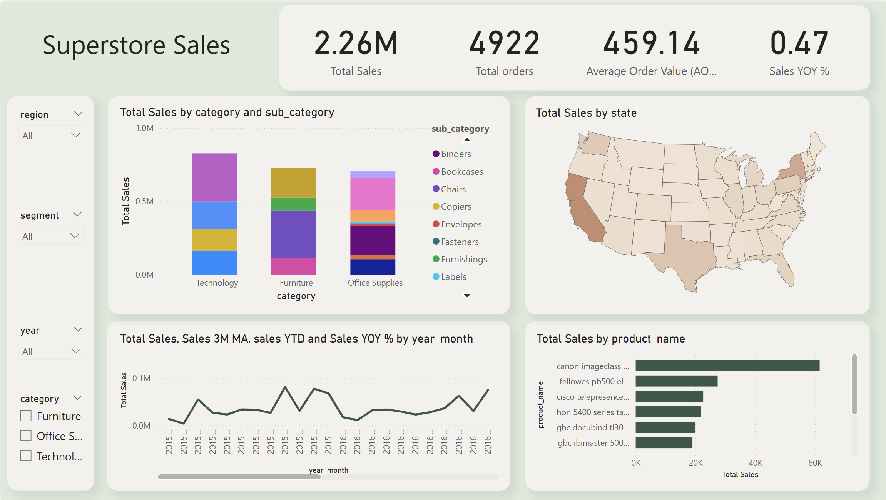

# Superstore Sales Dashboard – Power BI

## Overview
This Power BI dashboard analyzes the Superstore dataset to provide interactive insights into sales trends, product categories, and regional performance. Designed for business intelligence and analytics learning purposes.

## Features
- Monthly **Sales Trends** (Year-Month)
- **Category & Sub-Category Breakdown**
- **Top Customers / Products Analysis**
- **Regional Sales Maps** (Shape Map)
- **KPIs**: Total Sales, Total Orders, Average Order Value, Sales YoY %

## Tools & Skills
- Power BI Desktop
- DAX (Total Sales, Sales YTD, Sales YoY %, etc.)
- BigQuery (dataset cleaning and aggregation)
- Dashboard design & interactive slicers

## How to Use
1. Open `Superstore-Dashboard.pbix` in Power BI Desktop.
2. Explore the dashboard using slicers (Year, Region, Category, Segment).
3. Hover over map regions for tooltips.

## Screenshots

## Notes
- Dataset is anonymized/sample data to respect privacy.
- All visuals, measures, and layout are designed for professional presentation and business insights.
